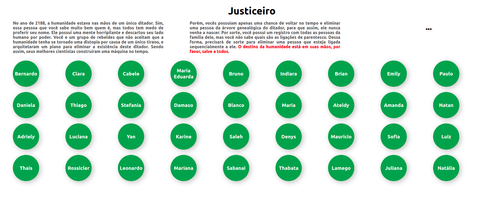
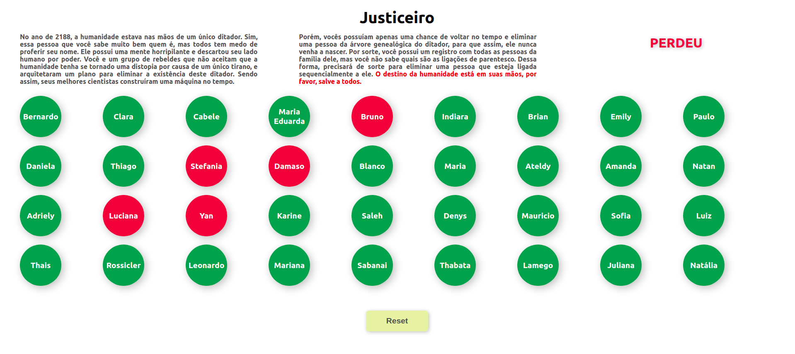
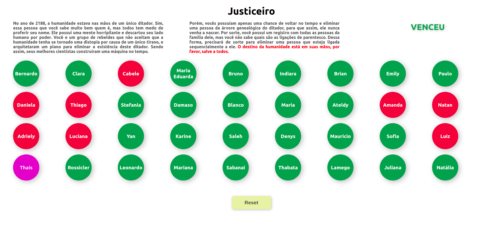

# Justiceiro

**Número da Lista**: 10<br>
**Conteúdo da Disciplina**: Grafos<br>

## Alunos
|Matrícula | Aluno |
| -- | -- |
| 15/0120371  |  Bruno Oliveira Dantas |
| 17/0031438  |  Dâmaso Júnio Pereira Brasileo |

## Sobre 

O **Justiceiro** é um joguinho referente à um viajante no tempo, que deseja matar um dos maiores genocidas que já existiu. Pra isso ele quer matar esse assassino, como ele não sabe onde (ou quando?) esse genocida está, então ele decide procurar pela sua família e matar algum dos seus familiares, antes do genocida ter nascido. Mas pode acontecer do **justiceiro** matar uma familia de inocentes, e então ele se torna o **genocida**.

## Screenshots








## Instalação 
**Linguagem**: JavaScript<br>
**Framework**: ReactJS<br>

Para instalação do projeto, é necessário executar os seguintes comandos:
```
git clone https://github.com/projeto-de-algoritmos/Grafos1-Justiceiro

cd Grafos1-Justiceiro

yarn install
```

## Uso 

Para execução do projeto é necessário, após a instalação:
```
cd Grafos1-Justiceiro

yarn start
```

## Outros 
O comando `yarn` pode ser trocado por `npm`:
```
npm install

npm start
```

É necessário ter o `NPM` ou `YARN` instalado.
